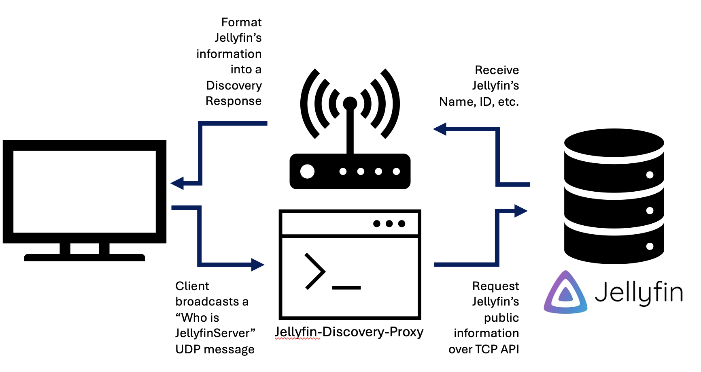

# Jellyfin Discovery Proxy

## Overview

Jellyfin Discovery Proxy enables automatic server discovery for Jellyfin clients when UDP packets cannot reach your Jellyfin server. This is particularly useful when clients are connecting through VPN connections or across network boundaries where broadcast discovery typically fails.

## How It Works

Jellyfin uses a UDP discovery protocol on port 7359 where clients broadcast a "Who is JellyfinServer?" message to automatically find servers on the network. 

This proxy:
1. Runs on a device that can receive these UDP broadcasts
2. Listens for discovery requests on port 7359
3. Forwards the request to your actual Jellyfin server via HTTP
4. Returns the server information to clients in the expected format

This allows automatic discovery to work even in network configurations where UDP broadcasts can't reach your server.



## Project Structure

```
jellyfin-discovery-proxy/
├── Makefile                # Build system for cross-platform compilation
├── project.conf            # Project metadata configuration
├── main.go                 # Main application code
├── Dockerfile              # Docker container definition
├── README.md               # This documentation file
├── LICENSE                 # MIT License
├── scripts/                # Helper scripts
│   └── docker-build.sh     # Docker multi-platform build helper
└── build/                  # Output directory for compiled binaries (created during build)
```

## Common Use Cases

### VPN Client Connections

When clients connect to your network through any VPN solution, they often can't discover Jellyfin servers through normal means. The proxy creates a "local server" entry on Jellyfin clients as if the server was directly on their network.

### Docker and Container Environments

In containerized environments, network isolation can prevent discovery requests from reaching your Jellyfin container.

### Separated Network Segments

Works across VLANs, subnets, or other network boundaries where broadcast traffic is filtered or blocked.

### Remote Access Scenarios

Enables discovery for remote Jellyfin servers as if they were on the local network.

## Running with Docker

The easiest way to run this application is with Docker:

```bash
# Pull and run with environment variable
docker run -d \
  --name jellyfin-discovery-proxy \
  --network=host \
  -p 7359:7359/udp \
  -e JELLYFIN_SERVER_URL=http://your-jellyfin-server.com:8096 \
  -e PROXY_URL=http://ip-or-friendly-name-of-device.local \
  -e CACHE_DURATION=12 \
  jpkribs/jellyfin-discovery-proxy
```

### Docker Compose Example

Create a `docker-compose.yml` file with the following contents:

```yaml
version: '3'

services:
  jellyfin-discovery-proxy:
    image: jpkribs/jellyfin-discovery-proxy:latest
    container_name: jellyfin-discovery-proxy
    network_mode: host # Required: Bridged/VLAN networks typically do not receive discovery broadcasts
    restart: unless-stopped
    ports:
      - "7359:7359/udp"
    environment:
      - JELLYFIN_SERVER_URL=http://your-jellyfin-server.com:8096
      - PROXY_URL=http://ip-or-friendly-name-of-device.local # Optional: use a local name different that the server url
      - CACHE_DURATION=12 # Optional: cache server info for 12 hours
      # Optional: can specify log level if needed
      # - LOG_LEVEL=info
```

Then run with Docker Compose:
```bash
docker-compose up -d
```

## Building from Source

If you prefer to build from source:

```bash
# Clone repository
git clone https://github.com/jpkribs/jellyfin-discovery-proxy.git
cd jellyfin-discovery-proxy

# Build
go build -o jellyfin-discovery-proxy

# Run
PROXY_URL=http://ip-or-friendly-name-of-device.local JELLYFIN_SERVER_URL=https://your-jellyfin-server.com:8096 CACHE_DURATION=6 ./jellyfin-discovery-proxy
```

## Using the Makefile

The project includes a Makefile that can compile the application for various platforms:

```bash
# Build for all platforms (Windows, macOS, Linux, and OpenWRT)
make

# Build only for specific platforms
make linux     # Build only Linux binaries
make windows   # Build only Windows binaries
make mac       # Build only macOS binaries (mac alias works)
make macos     # Build only macOS binaries (macos alias works)
make openwrt   # Build only OpenWRT/MIPS binaries

# Build Docker image only
make docker

# Clean the build directory
make clean

# View all available options
make help
```

After running the build commands, you'll find the binaries and archives in the `build` directory.

## Configuration File

The project uses a `project.conf` file to store metadata:

```makefile
# Application metadata
APP_NAME := jellyfin-discovery-proxy
VERSION := 1.2.0
OWNER := jpkribs

# Build directory
BUILD_DIR := ./build
```

This configuration is used by the Makefile and Docker build process. When updating the project version or changing the owner, just modify this file.

## Cross-Platform Compatibility

This application is designed to run on multiple platforms:

### OpenWRT - Untested

The Go implementation can be cross-compiled for OpenWRT routers (including MIPS architectures) by using:

```bash
make openwrt
```

The resulting binary is small enough to run on most OpenWRT devices with limited storage and memory.

### Windows, macOS, and Linux

Cross-compilation for major desktop platforms is simple with the Makefile:

```bash
# For Windows
make windows

# For macOS
make mac  # or make macos (both work)

# For Linux
make linux
```

## Runtime Configuration

The application is configured using environment variables:

| Variable | Description | Default |
|----------|-------------|---------|
| `JELLYFIN_SERVER_URL` | The URL to your Jellyfin server for API calls | `http://localhost:8096` |
| `PROXY_URL` | Optional URL to use in discovery responses (useful for proxies/NAT) | Uses `JELLYFIN_SERVER_URL` if not set |
| `CACHE_DURATION` | Number of hours to cache server information | `24` |

### Cache Duration Options

The `CACHE_DURATION` environment variable controls how long server information is cached:

- Default: `24` (caches for 24 hours)
- Any positive number: Caches for that many hours
- `0`: Caches until the application restarts (useful for stable environments)
- Not set: Uses the default of 24 hours

Adjust this value based on your specific needs:
- Lower values (1-6 hours) for frequently changing server configurations
- Higher values (24+ hours) for stable environments
- Set to `0` to minimize API calls in unchanging environments

### Address Selection Logic

1. If `PROXY_URL` is set, it will be used as the `Address` in discovery responses
2. If `PROXY_URL` is not set, then `JELLYFIN_SERVER_URL` will be used
3. If neither is valid, the default `http://localhost:8096` will be used

This configuration is particularly useful when your Jellyfin server is accessed internally using one URL (for API calls) but needs to be advertised externally using a different URL (for client connections).

## Deployment Recommendations

### Home Router or Network Device

Install on a device that can receive broadcast traffic from all client devices. A router running OpenWRT, a Raspberry Pi, or a NAS device works well.

### Cloud or Remote Server

When your Jellyfin instance is hosted remotely, deploy the proxy locally on your network to make remote servers appear as local ones.

### Multi-Network Setups

For environments with multiple network segments, consider deploying one proxy instance per segment where clients need discovery.

## Features

- **Configurable Caching**: Customize how long server information is cached
- **Smart Fallback**: Won't respond if the Jellyfin server is unreachable
- **Lightweight**: Minimal resource usage makes it suitable for small devices
- **Cross-Platform**: Runs on virtually any operating system
- **Dual URL Support**: Separate internal server URL and advertised client URL
- **Avahi Support**: Outputs both Avahi service.local and direct IP for usage on non-Avahi eligible devices

## Troubleshooting

If you're having issues:

1. Check that UDP port 7359 is open on your firewall
2. Verify your Jellyfin server is accessible at the URL specified
3. Check the logs with `docker logs jellyfin-discovery-proxy`
4. Make sure the `/System/Info/Public` endpoint is accessible on your Jellyfin server

## License

This project is licensed under the [MIT License](https://github.com/JPKribs/jellyfin-discovery-proxy/blob/main/LICENSE).