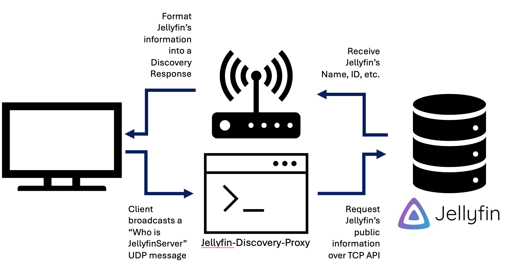
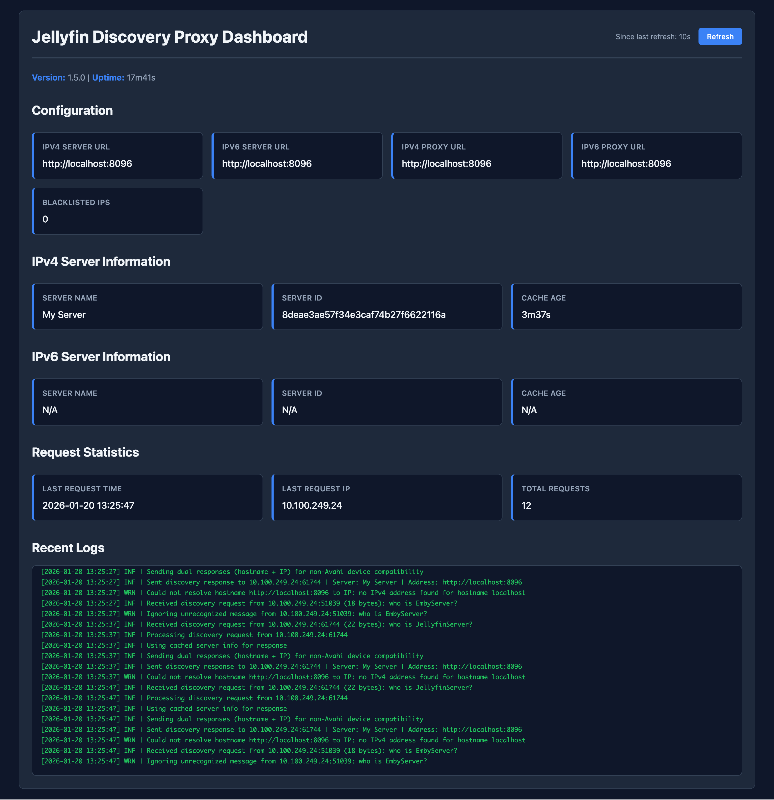

# Jellyfin Discovery Proxy

A lightweight proxy that enables automatic Jellyfin server discovery across network boundaries where UDP broadcasts fail (VPNs, Docker, VLANs, etc.).



## Quick Start

```bash
docker run -d \
  --name jellyfin-discovery-proxy \
  --network=host \
  -e JELLYFIN_SERVER_URL=http://your-server:8096 \
  -e PROXY_URL=http://proxy-device.local \
  jpkribs/jellyfin-discovery-proxy
```

Access the dashboard at `http://localhost:8080`

## Configuration

### Core Environment Variables

| Variable | Description | Default |
|----------|-------------|---------|
| `JELLYFIN_SERVER_URL` | Jellyfin server URL (legacy mode for both IPv4/IPv6) | `http://localhost:8096` |
| `JELLYFIN_SERVER_URL_IPV4` | IPv4-specific server URL | Uses `JELLYFIN_SERVER_URL` |
| `JELLYFIN_SERVER_URL_IPV6` | IPv6-specific server URL | Uses `JELLYFIN_SERVER_URL` |
| `PROXY_URL` | URL advertised to clients (legacy mode) | Uses `JELLYFIN_SERVER_URL` |
| `PROXY_URL_IPV4` | IPv4-specific proxy URL | Uses `JELLYFIN_SERVER_URL_IPV4` |
| `PROXY_URL_IPV6` | IPv6-specific proxy URL | Uses `JELLYFIN_SERVER_URL_IPV6` |

### Webhook Configuration

Execute custom logic when discovery events occur:

| Variable | Description | Example |
|----------|-------------|---------|
| `HOOK_ON_RECEIVE_URL` | HTTP webhook URL called when discovery request received | `http://your-server/webhook` |
| `HOOK_ON_RECEIVE_CMD` | Shell command executed when discovery request received | `bash /scripts/log-request.sh` |
| `HOOK_ON_SEND_URL` | HTTP webhook URL called before sending response | `http://your-server/webhook` |
| `HOOK_ON_SEND_CMD` | Shell command executed before sending response | `bash /scripts/log-response.sh` |

**Webhook Payloads:**
- **onReceive**: `{timestamp, client_ip, client_port, message, local_socket}`
- **onSend**: `{timestamp, client_ip, client_port, server_id, server_name, address_url, response_bytes}`

Payloads are sent as JSON via POST (URLs) or stdin (commands).

### Additional Options

| Variable | Description | Default |
|----------|-------------|---------|
| `HTTP_PORT` | Dashboard and health check port | `8080` |
| `CACHE_DURATION` | Hours to cache server info (0 = until restart) | `24` |
| `LOG_LEVEL` | Logging level (`debug`, `info`, `warn`, `error`) | `info` |
| `LOG_BUFFER_SIZE` | Log lines kept in memory for dashboard | `1024` |
| `BLACKLIST` | Comma-separated IPs/subnets to block | None |
| `NETWORK_INTERFACE` | Bind to specific interface (e.g., `eth0`) | All interfaces |

### Docker Compose Example

Create a `docker-compose.yml` file with the following contents:

```yaml
services:
  jellyfin-discovery-proxy:
    image: jpkribs/jellyfin-discovery-proxy:latest
    network_mode: host
    restart: unless-stopped
    environment:
      - JELLYFIN_SERVER_URL=http://your-server:8096
      - PROXY_URL=http://proxy-device.local
      - CACHE_DURATION=12
      - LOG_LEVEL=info
      # Webhooks (optional)
      # - HOOK_ON_RECEIVE_URL=http://your-server/webhook
      # - HOOK_ON_SEND_CMD=bash /scripts/notify.sh
      # IP filtering (optional)
      # - BLACKLIST=192.168.0.100,192.168.1.0/24
```

## Webhook Examples

### URL Webhook
```bash
HOOK_ON_RECEIVE_URL=http://your-server/api/webhook
HOOK_ON_SEND_URL=http://your-server/api/log
```

### Command Webhook
```bash
HOOK_ON_RECEIVE_CMD='jq -r ".client_ip" | logger -t jellyfin-discovery'
HOOK_ON_SEND_CMD='bash /usr/local/bin/notify-admin.sh'
```

## Web Dashboard

Access at `http://localhost:8080` to view:
- Server information (IPv4/IPv6)
- Request statistics
- Live logs
- Configuration overview



Health check: `http://localhost:8080/health`

## Building from Source

```bash
git clone https://github.com/jpkribs/jellyfin-discovery-proxy.git
cd jellyfin-discovery-proxy
make        # Build for all platforms
make docker # Build Docker image
```

## Troubleshooting

- Ensure UDP port 7359 is open
- Verify Jellyfin server `/System/Info/Public` endpoint is accessible
- Check logs via `docker logs` or dashboard
- Use `LOG_LEVEL=debug` for detailed diagnostics

## License

This project is licensed under the [MIT License](https://github.com/JPKribs/jellyfin-discovery-proxy/blob/main/LICENSE).
